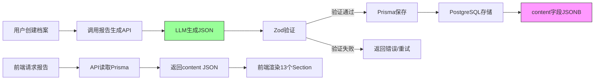

# 主报告数据存储结构说明

## 一、存储方式

### 1. Prisma Schema 定义

```prisma
model MainReport {
  id              String   @id @default(cuid())
  archiveId       String   @unique
  createdAt       DateTime @default(now())
  updatedAt       DateTime @updatedAt
  
  // === 核心字段：完整结构化 JSON ===
  content         Json     @db.Json
  
  // === 冗余索引字段（便于查询，无需解析 JSON）===
  lifeScriptTitle String   @db.VarChar(100)
  baziDisplay     String   @db.VarChar(50)
  
  // === 关联 ===
  archive         Archive  @relation(fields: [archiveId], references: [id], onDelete: Cascade)
  
  @@index([archiveId])
  @@index([createdAt])
}
```

### 2. 数据库实际存储示例（PostgreSQL）

**表结构：**

| 列名 | 类型 | 说明 | 示例值 |
|-----|------|------|--------|
| `id` | VARCHAR(30) | 主键 | `rep_clxxxxx001` |
| `archiveId` | VARCHAR(30) | 关联档案ID（唯一） | `arch_clxxxxx002` |
| `createdAt` | TIMESTAMP | 创建时间 | `2026-01-29 10:30:00` |
| `updatedAt` | TIMESTAMP | 更新时间 | `2026-01-29 10:30:00` |
| **`content`** | **JSONB** | **完整报告JSON** | 见下方 |
| `lifeScriptTitle` | VARCHAR(100) | 人生剧本标题（冗余） | `怒海争锋·破蛋成蝶` |
| `baziDisplay` | VARCHAR(50) | 八字显示（冗余） | `己已 辛未 乙未 癸未` |

**`content` 字段存储的完整 JSON：**

```json
{
  "lifeScriptTitle": "怒海争锋·破蛋成蝶",
  "lifeScriptDescription": "早年性格叛逆，多才多艺但学而不精...",
  "coreAbility": "越是危机时刻，越是规则崩坏的地方...",
  "coreAbilityTags": ["#破壁者", "#拓荒领袖"],
  "baziDisplay": "己已 辛未 乙未 癸未",
  "radarData": [
    { "name": "自我", "value": 95, "fullMark": 100 },
    { "name": "财富", "value": 82, "fullMark": 100 },
    ...
  ],
  "dimensionDetails": [...],
  "personalityTraits": [...],
  "personalityLabels": [...],
  "palaceAnalysis": {
    "surfacePersonality": { "title": "...", "description": "..." },
    "deepDesire": { ... },
    ...
  },
  "careerDestiny": { ... },
  "lifeStages": [...],
  "yearlyFortuneChart": [...],
  "yearlyDetails": [...],
  "socialCard": "..."
}
```

---

## 二、数据流程图



---

## 三、为什么用 JSON 字段而不是关系表？

### 优势：

1. **避免超宽表**：主报告有 13 个 section，展开成列需 65+ 字段，维护困难
2. **灵活性**：未来增加字段无需 ALTER TABLE，直接更新 JSON Schema
3. **原子性**：一次查询即可获取完整报告，无需多表 JOIN
4. **类型一致性**：JSON 字段与 TypeScript 类型一一对应，前后端无需转换

### 劣势（已通过设计解决）：

1. **查询困难** → 冗余 `lifeScriptTitle` 和 `baziDisplay` 字段用于列表查询
2. **索引限制** → PostgreSQL 的 JSONB 支持 GIN 索引，可高效查询嵌套字段
3. **类型安全** → Zod 验证确保存储前数据完整性

---

## 四、API 保存示例代码

### 后端：生成并保存报告

```typescript
// src/app/api/report/generate/route.ts
import { prisma } from '@/lib/prisma'
import { MainReportSchema } from '@/lib/validators/report-schemas'
import { generateReportWithLLM } from '@/lib/llm'

export async function POST(request: Request) {
  const { archiveId } = await request.json()
  
  // 1. 获取用户档案信息
  const archive = await prisma.archive.findUnique({
    where: { id: archiveId }
  })
  
  // 2. 调用 LLM 生成报告
  const llmOutput = await generateReportWithLLM(archive)
  
  // 3. Zod 验证
  const validated = MainReportSchema.parse(llmOutput)
  
  // 4. 保存到数据库（完整 JSON 存 content 字段）
  const mainReport = await prisma.mainReport.create({
    data: {
      archiveId: archive.id,
      content: validated,                       // 完整 JSON
      lifeScriptTitle: validated.lifeScriptTitle, // 冗余字段
      baziDisplay: validated.baziDisplay          // 冗余字段
    }
  })
  
  return Response.json(mainReport)
}
```

### 后端：读取报告

```typescript
// src/app/api/report/[archiveId]/route.ts
import { prisma } from '@/lib/prisma'

export async function GET(
  request: Request,
  { params }: { params: { archiveId: string } }
) {
  const mainReport = await prisma.mainReport.findUnique({
    where: { archiveId: params.archiveId }
  })
  
  if (!mainReport) {
    return Response.json({ error: 'Report not found' }, { status: 404 })
  }
  
  // 直接返回 content 字段（已是结构化 JSON）
  return Response.json({
    id: mainReport.id,
    archiveId: mainReport.archiveId,
    createdAt: mainReport.createdAt.toISOString(),
    ...mainReport.content  // 解构 JSON 字段
  })
}
```

---

## 五、前端使用示例

```typescript
// src/app/report/page.tsx
const { data: mainReport } = await fetch(`/api/report/${archiveId}`)

// 可以直接使用所有字段
console.log(mainReport.lifeScriptTitle)        // "怒海争锋·破蛋成蝶"
console.log(mainReport.radarData)              // [{ name: '自我', value: 95, ... }]
console.log(mainReport.palaceAnalysis.surfacePersonality.title)  // "两火日元"
```

---

## 六、数据库查询示例

### 1. 查询某用户的所有报告标题（用冗余字段）

```sql
SELECT 
  m.id,
  m."lifeScriptTitle",
  m."baziDisplay",
  m."createdAt"
FROM "MainReport" m
JOIN "Archive" a ON m."archiveId" = a.id
WHERE a."userId" = 'user_xxx'
ORDER BY m."createdAt" DESC;
```

### 2. 查询 JSON 内部字段（PostgreSQL JSONB）

```sql
-- 查询所有雷达图"自我"维度 > 90 的报告
SELECT 
  "archiveId",
  content -> 'radarData' -> 0 ->> 'value' AS "自我分值"
FROM "MainReport"
WHERE (content -> 'radarData' -> 0 ->> 'value')::int > 90;
```

### 3. 更新 JSON 部分字段

```sql
-- 修改社交名片内容
UPDATE "MainReport"
SET content = jsonb_set(
  content,
  '{socialCard}',
  '"新的社交名片内容"'
)
WHERE id = 'rep_xxx';
```

---

## 七、数据备份与迁移

### 导出 JSON 数据

```bash
# 导出所有主报告的 content 字段
psql -d lifecode -c "COPY (SELECT id, content FROM \"MainReport\") TO '/tmp/reports.csv' CSV HEADER;"
```

### Schema 变更策略

如果未来需要增加字段（如新增 `coreAbilityScore`）：

1. **更新 TypeScript 类型**：`src/lib/types/api.ts`
2. **更新 Zod Schema**：`src/lib/validators/report-schemas.ts`
3. **数据迁移脚本**（可选）：
   ```typescript
   // scripts/migrate-add-score.ts
   const reports = await prisma.mainReport.findMany()
   for (const report of reports) {
     await prisma.mainReport.update({
       where: { id: report.id },
       data: {
         content: {
           ...report.content,
           coreAbilityScore: calculateScore(report.content.coreAbility)
         }
       }
     })
   }
   ```

---

## 八、总结

**数据存储模式：**
- ✅ 完整结构化 JSON 存储在 `content` 字段（PostgreSQL JSONB）
- ✅ 关键字段冗余存储（`lifeScriptTitle`、`baziDisplay`）便于查询
- ✅ 生成时经过 Zod 验证，确保结构完整性
- ✅ 前端直接使用 JSON，无需复杂转换

**优势：**
- 一次查询获取完整报告，减少数据库负担
- 灵活扩展，无需频繁修改表结构
- 前后端类型一致，开发效率高

**适用场景：**
- 报告数据结构复杂（13 个 section × 多层嵌套）
- 字段未来可能调整（AI 输出格式迭代）
- 查询以"完整读取"为主，少量字段搜索用冗余列
